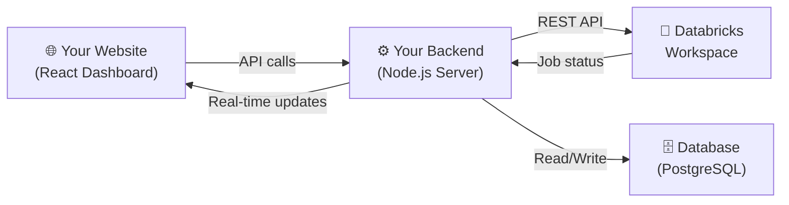
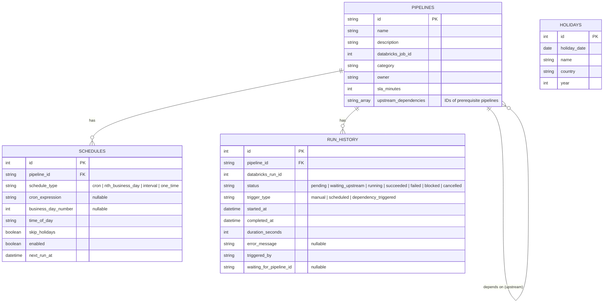

# 🚀 Databricks Pipeline Dashboard — POC Plan

A web-based dashboard to **manage, trigger, schedule, and monitor** all your Databricks pipelines from one place.

---

## How It Works (Simple Explanation)



> **In plain English:** Your website talks to YOUR backend server. Your backend server talks to Databricks. This way, your Databricks token stays safe on the server and never reaches the browser.

---

## 📋 Feature Breakdown

### 1. 📊 Dashboard (Home Page)
- **Overview cards**: Total pipelines, Running, Failed, Succeeded today
- **Charts**: Success rate over time, avg run duration, failure trends
- **Recent activity feed**: Last 10 pipeline runs with status badges
- **Health indicators**: Green/Yellow/Red per pipeline

### 2. 📋 Pipeline List Page
- Table of all pipelines with: Name, Last Run, Status, Next Scheduled Run
- **Search & Filter** by name, status, tag
- Click any pipeline → detailed view

### 3. ▶️ Manual Trigger
- "Run Now" button on each pipeline
- Optional: pass parameters before triggering (e.g., date, environment)
- Confirmation dialog before trigger
- Real-time status update after trigger

### 4. 📅 Smart Scheduling
This is the most interesting feature. Your scheduling options:

| Schedule Type | Example | How It Works |
|---|---|---|
| **Cron-based** | "Every day at 9 AM" | Standard cron expression |
| **Nth Business Day** | "2nd business day of month" | Skips weekends + holidays |
| **Holiday-aware** | "If holiday, move to next business day" | Uses a holiday calendar |
| **Interval** | "Every 6 hours" | Simple repeat |
| **One-time** | "Run on Sept 25 at 3 PM" | Single future execution |

#### Business Day Logic:
```
User sets: "Run on 2nd business day of each month"

October 2026:
  Oct 1 (Thu) → Business Day 1
  Oct 2 (Fri) → Business Day 2 ✅ TRIGGER HERE

But if Oct 2 is a holiday:
  Oct 3 (Sat) → Weekend, skip
  Oct 4 (Sun) → Weekend, skip  
  Oct 5 (Mon) → Business Day 2 ✅ TRIGGER HERE (moved forward)
```

### 5. 📈 Pipeline Status & Monitoring
- **Real-time status**: Started → Running → Succeeded/Failed
- **Run history**: Table of all past runs with duration, status, error messages
- **Auto-refresh** every 30 seconds (or WebSocket for instant updates)
- **Status badges**: 🟢 Succeeded | 🟡 Running | 🔴 Failed | ⚪ Pending

### 6. 🔔 Notifications (Bonus)
- Email/Slack alert on failure
- Browser push notification when a triggered job completes

---

## 🏗️ Tech Stack (Recommended)

### Why This Stack?
I'm recommending a stack that is **modern, easy to learn, and great for POCs**:

| Layer | Technology | Why? |
|---|---|---|
| **Frontend** | React + Vite + Tailwind CSS | Fast, component-based, beautiful UI |
| **UI Components** | shadcn/ui | Professional-looking pre-built components |
| **Charts** | Recharts or Chart.js | Easy to create dashboards |
| **Backend** | Node.js + Express | Same language as frontend (JavaScript) |
| **Database** | SQLite (dev) → PostgreSQL (prod) | Store schedules, holiday calendar, run history |
| **Scheduler** | node-cron + custom business-day logic | Handles all scheduling types |
| **API Integration** | Databricks REST API 2.1 | Trigger jobs, get status |
| **Real-time** | Polling (simple) or Socket.io (advanced) | Live status updates |

> [!TIP]
> **For a POC**, SQLite is perfect — zero setup, just a file. When you go to production, switch to PostgreSQL.

---

## 🗂️ Project Structure

```
pipeline-dashboard/
├── frontend/                    # React app
│   ├── src/
│   │   ├── components/
│   │   │   ├── Dashboard.jsx         # Home dashboard with charts
│   │   │   ├── PipelineList.jsx      # List all pipelines
│   │   │   ├── PipelineDetail.jsx    # Single pipeline detail
│   │   │   ├── TriggerButton.jsx     # Manual trigger button
│   │   │   ├── ScheduleForm.jsx      # Create/edit schedule
│   │   │   ├── StatusBadge.jsx       # Status indicator
│   │   │   ├── RunHistory.jsx        # Past runs table
│   │   │   └── HolidayCalendar.jsx   # Manage holidays
│   │   ├── pages/
│   │   │   ├── DashboardPage.jsx
│   │   │   ├── PipelinesPage.jsx
│   │   │   ├── SchedulesPage.jsx
│   │   │   └── SettingsPage.jsx
│   │   ├── hooks/
│   │   │   ├── usePipelines.js       # Fetch pipeline data
│   │   │   └── useWebSocket.js       # Real-time updates
│   │   └── App.jsx
│   └── package.json
│
├── backend/                     # Node.js API server
│   ├── src/
│   │   ├── routes/
│   │   │   ├── pipelines.js          # CRUD for pipelines
│   │   │   ├── triggers.js           # Manual trigger endpoint
│   │   │   ├── schedules.js          # Schedule CRUD
│   │   │   └── dashboard.js          # Dashboard stats
│   │   ├── services/
│   │   │   ├── databricksService.js  # Databricks API wrapper
│   │   │   ├── schedulerService.js   # Cron + business day logic
│   │   │   └── holidayService.js     # Holiday calendar logic
│   │   ├── models/
│   │   │   ├── pipeline.js           # Pipeline config model
│   │   │   ├── schedule.js           # Schedule model
│   │   │   ├── runHistory.js         # Run history model
│   │   │   └── holiday.js            # Holiday model
│   │   └── app.js
│   └── package.json
│
├── pipelines.config.json        # ⬅️ Add new pipelines here!
└── README.md
```

---

## 🔧 Making It Scalable — Adding New Pipelines

> [!IMPORTANT]
> **This is the key design decision**: Pipelines are defined in a simple JSON config file. To add a new pipeline, just add a new entry — no code changes needed!

```json
// pipelines.config.json
{
  "pipelines": [
    {
      "id": "etl-daily-sales",
      "name": "Daily Sales ETL",
      "description": "Loads sales data from source to warehouse",
      "databricks_job_id": 123456,
      "category": "ETL",
      "tags": ["sales", "daily"],
      "default_params": {
        "environment": "production"
      },
      "owner": "data-team",
      "sla_minutes": 60
    },
    {
      "id": "ml-model-training",
      "name": "ML Model Retraining",
      "description": "Retrains the recommendation model",
      "databricks_job_id": 789012,
      "category": "ML",
      "tags": ["ml", "weekly"],
      "default_params": {},
      "owner": "ml-team",
      "sla_minutes": 120
    }
  ]
}
```

**To add a new pipeline:**
1. Add a new JSON object to the array ✅
2. That's it! The dashboard automatically picks it up ✅

---

## 📅 Database Schema



---

## 🌐 Where to Deploy?

### Option A: Quick & Free (Best for POC Demo)

| Component | Platform | Cost |
|---|---|---|
| Frontend | **Vercel** or **Netlify** | Free |
| Backend | **Render** or **Railway** | Free tier |
| Database | **Neon** (PostgreSQL) or **SQLite on Render** | Free tier |

**Pros:** Zero cost, deploy in minutes, auto-deploys from GitHub  
**Cons:** Free tier has cold starts (first load may take ~5 sec)

### Option B: Cloud-based (Best for Company POC)

| Component | Platform | Cost |
|---|---|---|
| Full app | **Azure App Service** | Free tier available |
| Database | **Azure Database for PostgreSQL** | Low cost |
| Frontend | **Azure Static Web Apps** | Free |

**Pros:** Enterprise-grade, your company likely has Azure credits  
**Cons:** More setup involved

### Option C: Simple Single Server

| Component | Platform | Cost |
|---|---|---|
| Everything | **Single VM** (Azure/AWS/GCP) | ~\$5-10/month |
| Or | **Docker** on any server | Depends on server |

**Pros:** Full control, no cold starts, simple architecture  
**Cons:** You manage the server

> [!TIP]
> **My recommendation for your POC:** Start with **Option A** (Vercel + Render). It's free, fast to set up, and looks professional. If the team approves, move to **Option B** for production.

---

## 🎁 Additional Features You Can Add

### Must-Have (include in POC)
| Feature | Value |
|---|---|
| 🔐 **Login / Authentication** | Only authorized people can trigger pipelines |
| 📧 **Email Alerts on Failure** | Team gets notified instantly |
| 📝 **Audit Log** | Track who triggered what and when |
| 🏷️ **Pipeline Tags & Filters** | Organize by team, category |

### Nice-to-Have (impress the team)
| Feature | Value |
|---|---|
| 🔗 **Pipeline Dependencies** | "Run Pipeline B after Pipeline A succeeds" |
| 📊 **SLA Tracking** | Alert if pipeline takes longer than expected |
| 🌙 **Dark Mode** | Modern UI feel |
| 📱 **Mobile Responsive** | Check pipeline status from phone |
| 🔄 **Retry Failed Runs** | One-click retry with same parameters |
| 📋 **Run Comparison** | Compare two runs side-by-side (duration, data processed) |
| 🗓️ **Calendar View** | Visual calendar showing all scheduled runs |
| 🔀 **Environment Toggle** | Switch between Dev / Staging / Production |

### Advanced (future roadmap)
| Feature | Value |
|---|---|
| 📈 **Cost Tracking** | Show Databricks compute cost per pipeline |
| 🤖 **Auto-Retry with Backoff** | Automatically retry failed jobs |
| 🔔 **Slack Integration** | Post status updates to a Slack channel |
| 📊 **Data Quality Checks** | Show row counts, data freshness |
| 🧪 **Dry Run Mode** | Simulate a pipeline run without executing |

---

---

## 🛤️ Implementation Phases

### Phase 1 — Core Build ✅ (COMPLETED)
- [x] Set up React frontend + Node.js backend
- [x] Connect to Databricks REST API 2.1
- [x] Pipeline list page with live search & tags
- [x] Manual trigger ("Run Now" button with JSON parameters modal)
- [x] Automatic run status polling & sync (5-second Databricks reconciler)
- [x] Indian Holiday Calendar pre-seeded (2025-2027)
- [x] Nth Business Day of Month scheduling engine

---

### Phase 2 — Dependencies & UI Redesign 🚀 (CURRENT FOCUS)

#### 1. 🔗 Pipeline Dependency Engine (DAG Execution)
- **Upstream Dependency Rule:** A pipeline can declare one or more `upstream_dependencies` (e.g. Pipeline B requires Pipeline A).
- **Execution State Machine:**
  - When Pipeline B is triggered (manual or scheduled), it checks all upstream pipelines.
  - If upstream is **RUNNING / PENDING**: Pipeline B transitions to **WAITING_FOR_UPSTREAM / PENDING**.
  - If upstream completes with **SUCCESS**: Pipeline B automatically triggers on Databricks.
  - If upstream completes with **FAILED / CANCELLED**: Pipeline B transitions to **UPSTREAM_FAILED / BLOCKED** (does NOT trigger downstream job, preventing corrupt/partial data runs).
- **Recommended Architectural Enhancements:**
  - **Dependency DAG Visualizer:** Interactive visual flow (Mermaid / React Flow) showing Upstream ➔ Downstream relationships.
  - **Auto-Retry & Backoff:** If upstream fails due to transient compute error, allow 1-click retry of the entire dependency chain.
  - **Timeout Safeguard:** If upstream stays in running/pending longer than max SLA timeout, auto-fail or alert the downstream job to avoid infinite waiting loops.

#### 2. 🎨 UI Redesign: Rose Pink & Crisp White Theme + Data Engineering Aesthetics
- **Color Palette & Design System:**
  - **Primary Accents:** Soft rose pink (`#f43f5e`, `#fb7185`), rose gold, and blush highlights (`#fff1f2`).
  - **Backgrounds:** Crisp ultra-clean whites (`#ffffff`) with subtle, clean slate-rose tinted card borders (`#ffe4e6`).
  - **Typography & Polish:** High-contrast slate typography (`#1e293b`), elegant rounded cards, and smooth micro-animations.
- **Data Engineering Brand Imagery & Badges:**
  - Subtle, clean data pipeline iconography (Databricks 🧱, Spark ⚡, Delta Lake 🌊, Airflow 🌬️, ETL storage pipelines).
  - Modern data pipeline architecture flow background accents without visual clutter (tasteful gradient mesh + geometric data nodes).
  - Enhanced status badges with luminous glow indicators (Success, Waiting for Upstream, Running, Blocked).

---

### Phase 3 — Enterprise Monitoring & Multi-Workspace (Week 3)
- [ ] Multi-workspace toggle (Dev, UAT, Prod) in header
- [ ] Run comparison inspector (compare two runs side-by-side: duration, logs, parameters)
- [ ] Email & Slack webhook alerts on pipeline failure
- [ ] Audit logs (who triggered what job and when)

---

### Phase 4 — Cloud & Docker Deployment (Week 4)
- [ ] Option 1: Vercel (Frontend) + Render (Backend) automated deployment
- [ ] Option 2: Docker Compose & Azure Container Registry (ACR) + Azure App Service CI/CD GitHub Actions

---

## User Review Required

> [!IMPORTANT]
> **Please confirm before I start building:**

1. **Which Databricks cloud are you using?** (Azure Databricks / AWS Databricks / GCP Databricks) — This affects the API URL format.

2. **Do you have a Databricks Personal Access Token (PAT) ready?** — I'll need this to test the API connection.

3. **Deployment preference** — Which option do you prefer?
   - Option A: Free (Vercel + Render) — best for quick demo
   - Option B: Azure — best if company has Azure
   - Option C: Single server / Docker

4. **Tech stack confirmation** — Are you comfortable with React + Node.js? Or would you prefer Python (Flask/FastAPI) for the backend?

5. **Holiday calendar** — Which country's holidays should we use? (India? US? Both?)

6. **How many pipelines do you currently have in Databricks?** (rough number)

## Open Questions

> [!IMPORTANT]
> These will affect how I build the scheduling system:

- When you say "2nd business day", do you mean 2nd business day **of the month** or 2nd business day **of the week**?
- Should the scheduler run jobs at a specific **time** on that business day (e.g., 9:00 AM IST)?
- Do you need the dashboard to support **multiple Databricks workspaces**, or just one?
